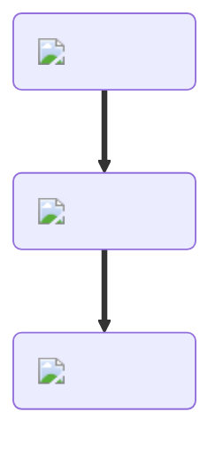

---
hide:
  - toc
---
<figure markdown="1">
# Steak
{ .item-image }

```mermaid
graph TD
    BEEF(<img src="../../assets/images/cooking/beef.webp" width="50"/>)
    POT(<img src="../../assets/images/cooking/pot.webp" width="50"/>)
    STEAK(<img src="../../assets/images/cooking/steak.webp" width="50"/>)

    BEEF ==> POT
    POT ==> STEAK

    click BEEF "../beef"
    click POT "../pot"
    click STEAK "../steak"
```

</figure>