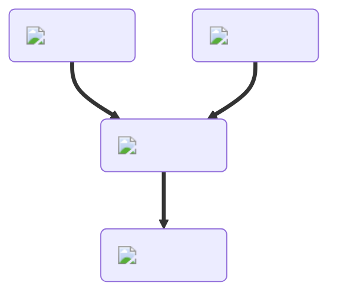

---
hide:
  - toc
description: How to make syrup in yeeps hide and seek
---
<figure markdown="1">
# Syrup
{ .item-image }

## Used to craft

- [French Toast { width="100" }](../cooking/frenchToast.md)
- [Pancakes { width="100" }](../cooking/pancakes.md)

</figure>