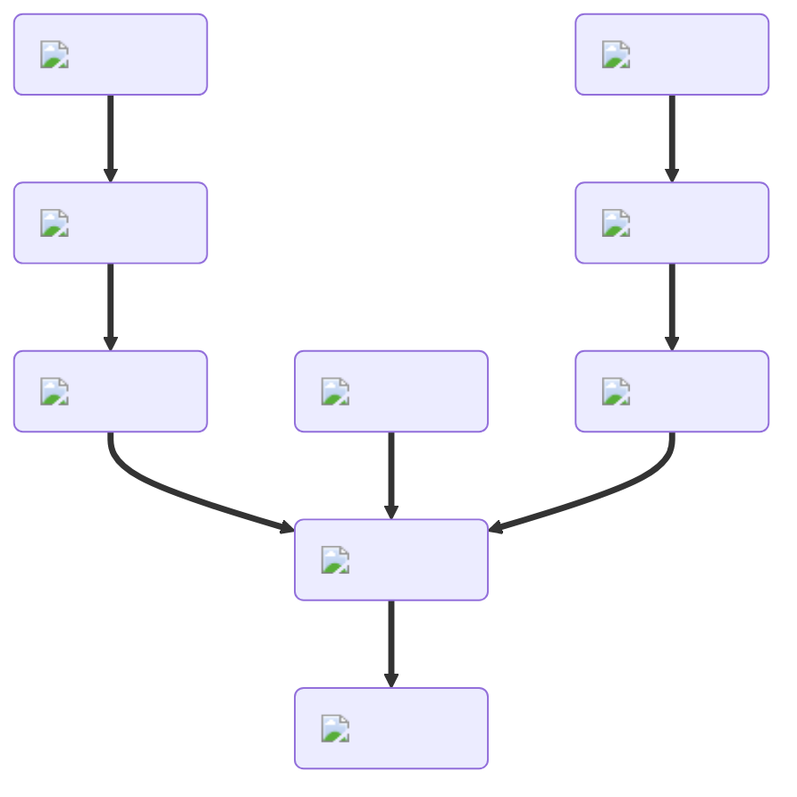

---
hide:
  - toc
---
<figure markdown="1">
# Beef Taco
{ .item-image }

```mermaid
graph TD
    FLOUR(<img src="../../assets/images/cooking/flour.webp" width="50"/>)
    POT1(<img src="../../assets/images/cooking/pot.webp" width="50"/>)
    TORTILLA(<img src="../../assets/images/cooking/tortilla.webp" width="50"/>)
    MILK(<img src="../../assets/images/cooking/milk.webp" width="50"/>)
    POT2(<img src="../../assets/images/cooking/pot.webp" width="50"/>)
    CHEESE(<img src="../../assets/images/cooking/cheese.webp" width="50"/>)
    BEEF(<img src="../../assets/images/cooking/beef.webp" width="50"/>)
    POT3(<img src="../../assets/images/cooking/pot.webp" width="50"/>)
    BEEFTACO(<img src="../../assets/images/cooking/tacoBeef.webp" width="50"/>)

    FLOUR ==> POT1
    POT1 ==> TORTILLA
    MILK ==> POT2
    POT2 ==> CHEESE
    TORTILLA ==> POT3
    BEEF ==> POT3
    CHEESE ==> POT3
    POT3 ==> BEEFTACO

    click FLOUR "../flour"
    click POT1 "../pot"
    click TORTILLA "../tortilla"
    click MILK "../milk"
    click POT2 "../pot"
    click CHEESE "../cheese"
    click BEEF "../beef"
    click POT3 "../pot"
    click BEEFTACO "../tacoBeef"
```

</figure>