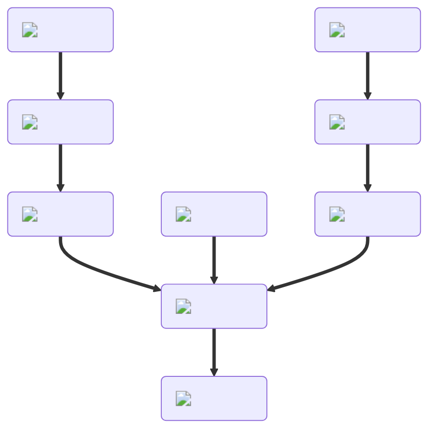

---
hide:
  - toc
description: How to make a chicken taco in yeeps hide and seek
---
<figure markdown="1">
# Chicken Taco
{ .item-image }

```mermaid
graph TD
    FLOUR(<img src="../../assets/images/cooking/flour.webp" width="50"/>)
    POT1(<img src="../../assets/images/cooking/pot.webp" width="50"/>)
    TORTILLA(<img src="../../assets/images/cooking/tortilla.webp" width="50"/>)
    MILK(<img src="../../assets/images/cooking/milk.webp" width="50"/>)
    POT2(<img src="../../assets/images/cooking/pot.webp" width="50"/>)
    CHEESE(<img src="../../assets/images/cooking/cheese.webp" width="50"/>)
    CHICKEN(<img src="../../assets/images/cooking/chicken.webp" width="50"/>)
    POT3(<img src="../../assets/images/cooking/pot.webp" width="50"/>)
    CHICKENTACO(<img src="../../assets/images/cooking/tacoChicken.webp" width="50"/>)

    FLOUR ==> POT1
    POT1 ==> TORTILLA
    MILK ==> POT2
    POT2 ==> CHEESE
    TORTILLA ==> POT3
    CHICKEN ==> POT3
    CHEESE ==> POT3
    POT3 ==> CHICKENTACO

    click FLOUR "../flour"
    click POT1 "../pot"
    click TORTILLA "../tortilla"
    click MILK "../milk"
    click POT2 "../pot"
    click CHEESE "../cheese"
    click CHICKEN "../chicken"
    click POT3 "../pot"
    click CHICKENTACO "../tacoChicken"
```

</figure>