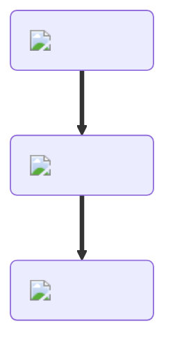

---
hide:
  - toc
---
<figure markdown="1">
# TomatoSoup
{ .item-image }

```mermaid
graph TD
    TOMATO(<img src="../../assets/images/cooking/tomato.webp" width="50"/>)
    POT(<img src="../../assets/images/cooking/pot.webp" width="50"/>)
    TOMATOSOUP(<img src="../../assets/images/cooking/tomatoSoup.webp" width="50"/>)
    
    TOMATO ==> POT
    POT ==> TOMATOSOUP

    click TOMATO "../tomato"
    click POT "../pot"
    click TOMATOSOUP "../tomatoSoup"
```

</figure>