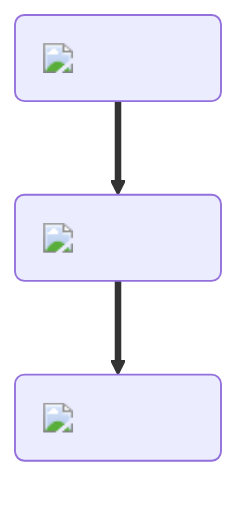

---
hide:
  - toc
description: How to make a tortilla in yeeps hide and seek
---
<figure markdown="1">
# Tortilla
{ .item-image }

## Used to craft

- [Quesadilla { width="100" }](../cooking/quesadilla.md)
- [Beef Taco { width="100" }](../cooking/tacoBeef.md)
- [Chicken Taco { width="100" }](../cooking/tacoChicken.md)

</figure>