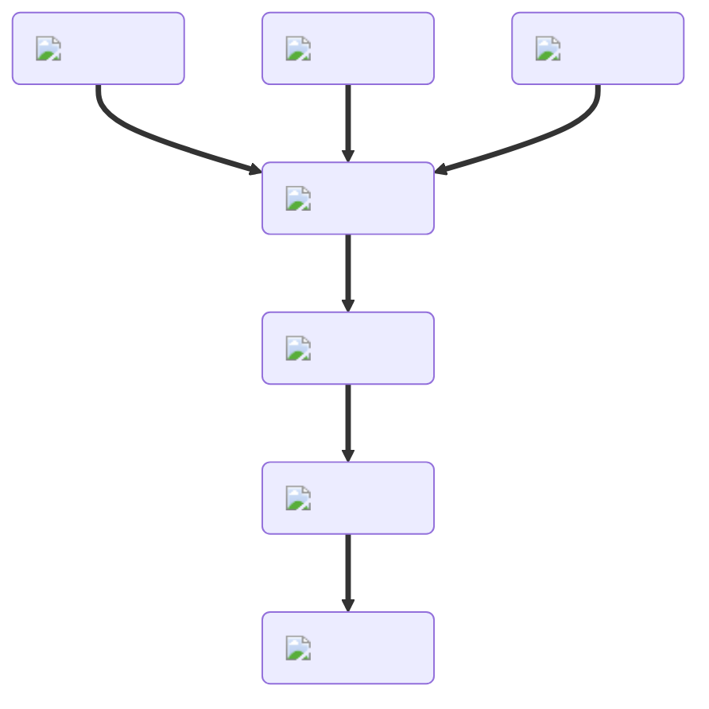

<figure markdown="1">
# Bagel
{ .item-image }

```mermaid
graph TD
    MILK(<img src="../../assets/images/milk.webp" width="50" />)
    EGGS(<img src="../../assets/images/egg.webp" width="50" />)
    FLOUR(<img src="../../assets/images/flour.webp" width="50" />)
    POT(<img src="../../assets/images/pot.webp" width="50" />)
    BATTER(<img src="../../assets/images/batter.webp" width="50" />)
    OVEN(<img src="../../assets/images/oven.webp" width="50" />)
    BAGEL(<img src="../../assets/images/bagel.webp" width="50" />)
    
    MILK ==> POT
    EGGS ==> POT
    FLOUR ==> POT
    POT ==> BATTER
    BATTER ==> OVEN
    OVEN ==> BAGEL 

    click MILK "../milk"
    click EGGS "../egg"
    click FLOUR "../flour"
    click POT "../pot"
    click BATTER "../batter"
    click OVEN "../oven"

```

## Used to craft

- [Donut { width="100" }](../recipes/donut.md)
- [Pizza Bagel { width="100"}](../recipes/pizzaBagel.md)

</figure>
