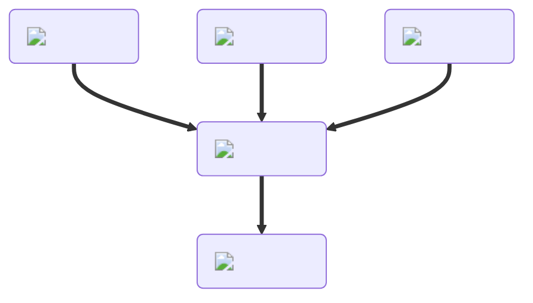

<figure markdown="1">
# Batter
{ .item-image }

## Used to craft

- [Bagel { width="100" }](../recipes/bagel.md)  
- [Cake { width="100" }](../recipes/cake.md)  
- [Chicken Tender { width="100" }](../recipes/chickenTender.md)  
- [Cookie { width="100" }](../recipes/cookie.md)  
- [Crepe { width="100" }](../recipes/crepe.md)  
- [Donut { width="100" }](../recipes/donut.md)  
- [Pizza Bagel { width="100" }](../recipes/pizzaBagel.md)  

</figure>