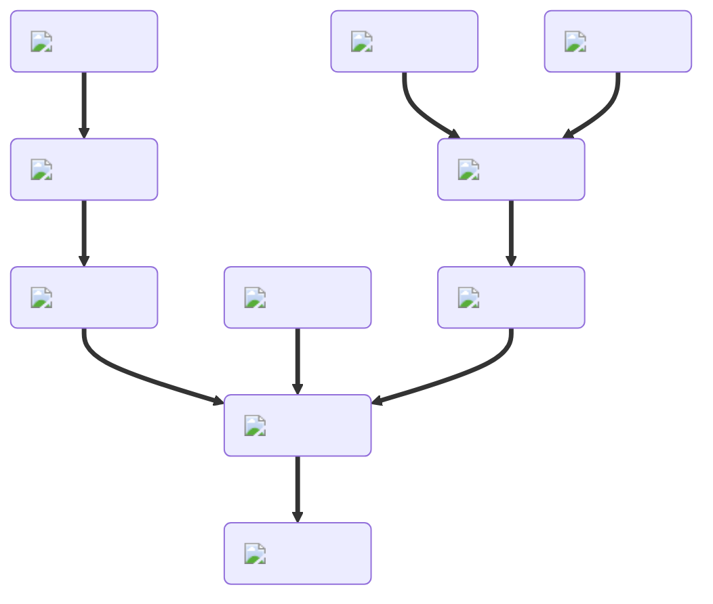

<figure markdown="1">
# BLT
{ .item-image }

```mermaid
graph TD
    OVEN(<img src="/assets/images/oven.webp" width="50"/>)
    FLOUR(<img src="/assets/images/flour.webp" width="50"/>)
    BREAD(<img src="/assets/images/bread.webp" width="50"/>)
    BACON(<img src="/assets/images/bacon.webp" width="50"/>)
    SALAD(<img src="/assets/images/salad.webp" width="50"/>)
    POT(<img src="/assets/images/pot.webp" width="50"/>)
    BLT(<img src="/assets/images/blt.webp" width="50"/>)
    TOMATO(<img src="/assets/images/tomato.webp" width="50"/>)
    LETTUCE(<img src="/assets/images/lettuce.webp" width="50"/>)
    POT2(<img src="/assets/images/pot.webp" width="50"/>)
    
    FLOUR ==> OVEN
    OVEN ==> BREAD
    BREAD ==> POT
    BACON ==> POT
    SALAD ==> POT
    POT ==> BLT
    TOMATO ==> POT2
    LETTUCE ==> POT2
    POT2 ==> SALAD

    click OVEN "/oven"
    click FLOUR "/flour"
    click BREAD "/bread"
    click BACON "/bacon"
    click SALAD "/salad"
    click POT "/pot"
    click BLT "/blt"
    click TOMATO "/tomato"
    click LETTUCE "/lettuce"
    click POT2 "/pot"

```
</figure>