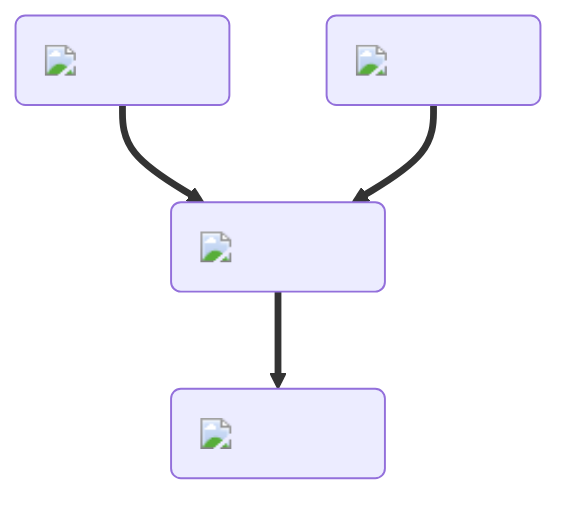

<figure markdown="1">
# Breakfast
{ .item-image }

```mermaid
graph TD

    EGG(<img src="/assets/images/egg.webp" width="50"/>)
    BACON(<img src="/assets/images/bacon.webp" width="50"/>)
    POT(<img src="/assets/images/pot.webp" width="50"/>)
    BREAKFAST(<img src="/assets/images/breakfast.webp" width="50"/>)

    EGG ==> POT
    BACON ==> POT
    POT ==> BREAKFAST

    click EGG "/egg"
    click BACON "/bacon"
    click POT "/pot"
    click BREAKFAST "/breakfast"

```
</figure>