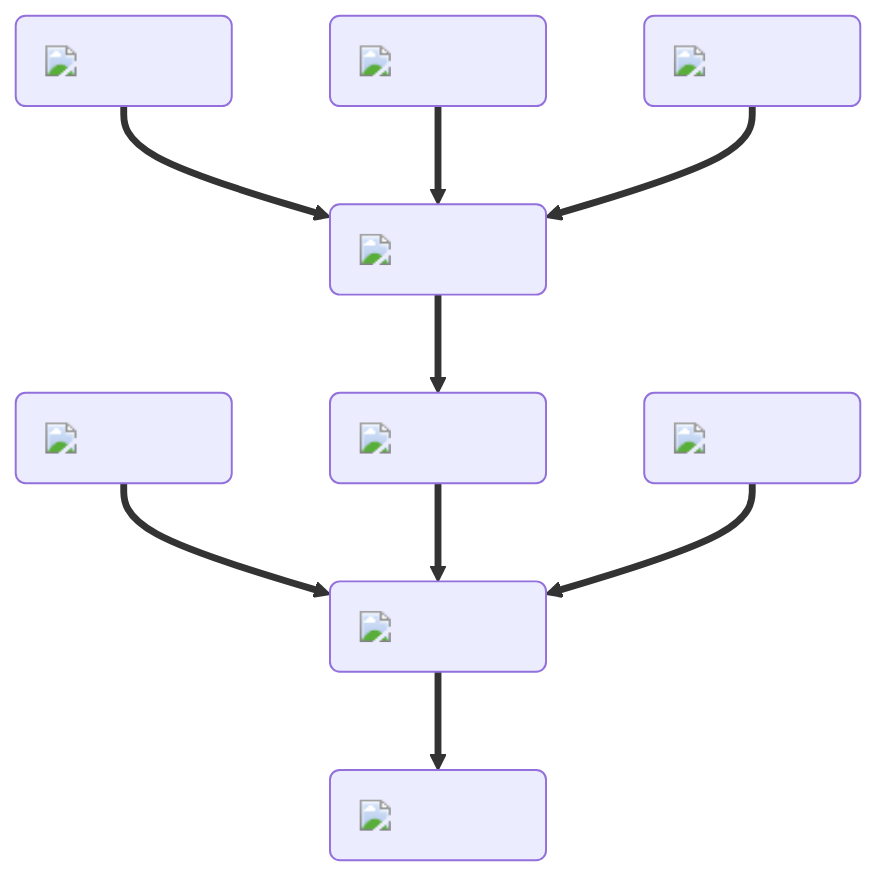

<figure markdown="1">
# Cake
{ .item-image }

```mermaid
graph TD

    FLOUR(<img src="/assets/images/flour.webp" width="50"/>)
    EGGS(<img src="/assets/images/egg.webp" width="50"/>)
    MILK(<img src="/assets/images/milk.webp" width="50"/>)
    POT(<img src="/assets/images/pot.webp" width="50"/>)
    BATTER(<img src="/assets/images/batter.webp" width="50"/>)
    FRUIT(<img src="/assets/images/fruit.webp" width="50"/>)
    SUGAR(<img src="/assets/images/sugar.webp" width="50"/>)
    OVEN(<img src="/assets/images/oven.webp" width="50"/>)
    CAKE(<img src="/assets/images/cake.webp" width="50"/>)

    FLOUR ==> POT
    EGGS ==> POT
    MILK ==> POT
    POT ==> BATTER
    FRUIT ==> OVEN
    BATTER ==> OVEN
    SUGAR ==> OVEN
    OVEN ==> CAKE

    click FLOUR "/flour"
    click EGGS "/egg"
    click MILK "/milk"
    click POT "/pot"
    click BATTER "/batter"
    click FRUIT "/fruit"
    click SUGAR "/sugar"
    click OVEN "/oven"
    click CAKE "/cake"

```

</figure>