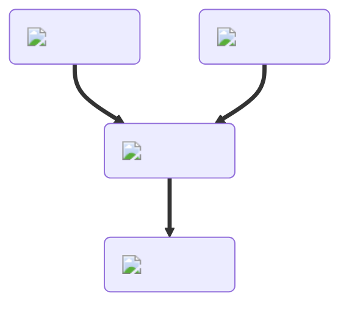

<figure markdown="1">
# Chicken Noodle Soup
{ .item-image }

```mermaid
graph TD
    NOODLES(<img src="/assets/images/noodles.webp" width="50"/>)
    CHICKEN(<img src="/assets/images/chicken.webp" width="50"/>)
    POT(<img src="/assets/images/pot.webp" width="50"/>)
    SOUP(<img src="/assets/images/chickenNoodleSoup.webp" width="50"/>)

    NOODLES ==> POT
    CHICKEN ==> POT
    POT ==> SOUP

    click NOODLES "/noodles"
    click CHICKEN "/chicken"
    click POT "/pot"
    click SOUP "/chickenNoodleSoup"
```

</figure>