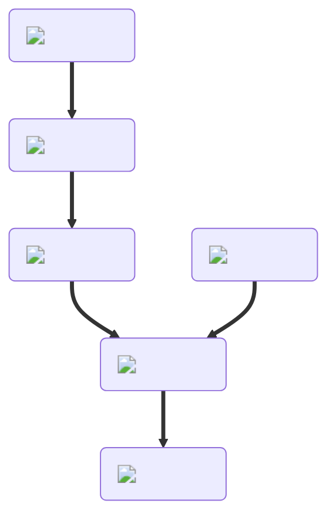

<figure markdown="1">
# chicken Parmesan
{ .item-image }

```mermaid
graph TD
    MILK(<img src="../../assets/images/milk.webp" width="50"/>)
    POT(<img src="../../assets/images/pot.webp" width="50"/>)
    CHEESE(<img src="../../assets/images/milk.webp" width="50"/>)
    CHICKEN(<img src="../../assets/images/chicken.webp" width="50"/>)
    OVEN(<img src="../../assets/images/oven.webp" width="50"/>)
    CHICKENPARM(<img src="../../assets/images/chickenParm.webp" width="50"/>)

    MILK ==> POT
    POT ==> CHEESE
    CHEESE ==> OVEN
    CHICKEN ==> OVEN
    OVEN ==> CHICKENPARM

    click MILK "../milk"
    click POT "../pot"
    click CHEESE "../cheese"
    click CHICKEN "../chicken"
    click OVEN "../oven"
    click CHICKENPARM "../chickenParm"
```

</figure>