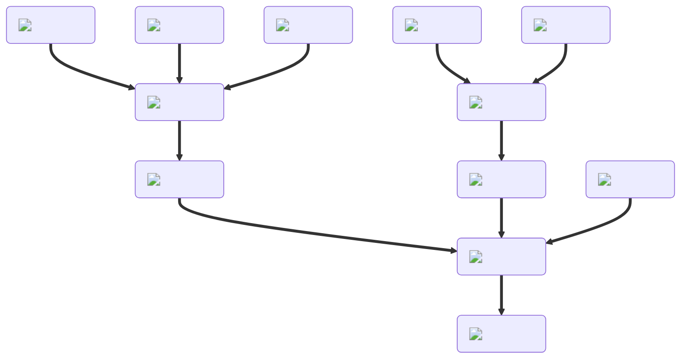

<figure markdown="1">
# Crepe
{ .item-image }

```mermaid
graph TD
    FLOUR(<img src="../../assets/images/flour.webp" width="50"/>)
    EGGS(<img src="../../assets/images/egg.webp" width="50"/>)
    MILK(<img src="../../assets/images/milk.webp" width="50"/>)
    POT1(<img src="../../assets/images/pot.webp" width="50"/>)
    BATTER(<img src="../../assets/images/batter.webp" width="50"/>)
    FRUIT1(<img src="../../assets/images/fruit.webp" width="50"/>)
    SUGAR(<img src="../../assets/images/sugar.webp" width="50"/>)
    OVEN(<img src="../../assets/images/pot.webp" width="50"/>)
    JELLY(<img src="../../assets/images/jelly.webp" width="50"/>)
    FRUIT2(<img src="../../assets/images/fruit.webp" width="50"/>)
    POT2(<img src="../../assets/images/pot.webp" width="50"/>)
    CREPE(<img src="../../assets/images/crepe.webp" width="50"/>)

    FLOUR ==> POT1
    EGGS==> POT1
    MILK ==> POT1
    POT1 ==> BATTER
    FRUIT1 ==> OVEN
    SUGAR ==> OVEN
    OVEN ==> JELLY
    BATTER ==> POT2
    JELLY ==> POT2
    FRUIT2 ==> POT2
    POT2 ==> CREPE

    click FLOUR "../flour"
    click EGGS "../egg"
    click MILK "../milk"
    click POT1 "../pot"
    click BATTER "../batter"
    click FRUIT1 "../fruit"
    click SUGAR "../sugar"
    click OVEN "../oven"
    click JELLY "../jelly"
    click FRUIT2 "../fruit"
    click POT2 "../pot"
    click CREPE "../crepe"

```

</figure>