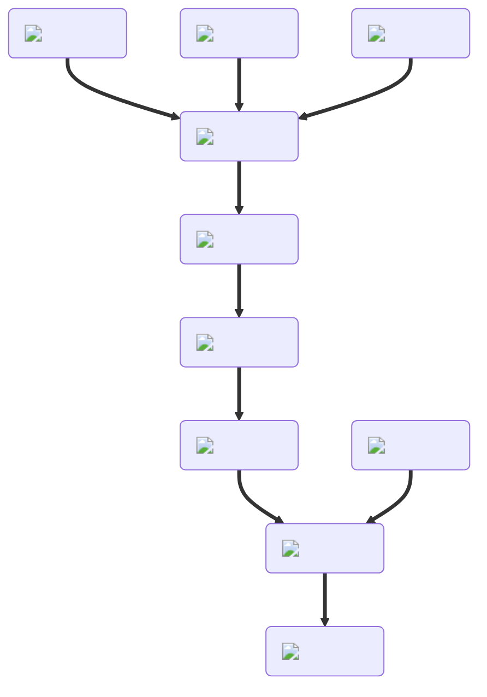

<figure markdown="1">
# Donut
{ .item-image }

```mermaid
graph TD
    FLOUR(<img src="../../assets/images/flour.webp" width="50"/>)
    EGGS(<img src="../../assets/images/egg.webp" width="50"/>)
    MILK(<img src="../../assets/images/milk.webp" width="50"/>)
    POT(<img src="../../assets/images/pot.webp" width="50"/>)
    BATTER(<img src="../../assets/images/batter.webp" width="50"/>)
    OVEN1(<img src="../../assets/images/oven.webp" width="50"/>)
    BAGEL(<img src="../../assets/images/bagel.webp" width="50"/>)
    SUGAR(<img src="../../assets/images/sugar.webp" width="50"/>)
    OVEN2(<img src="../../assets/images/oven.webp" width="50"/>)
    DONUT(<img src="../../assets/images/donut.webp" width="50"/>)

    FLOUR ==> POT
    EGGS ==> POT
    MILK ==> POT
    POT ==> BATTER
    BATTER ==> OVEN1
    OVEN1 ==> BAGEL
    BAGEL ==> OVEN2
    SUGAR ==> OVEN2
    OVEN2 ==> DONUT

    click FLOUR "../flour"
    click EGGS "../egg"
    click MILK "../milk"
    click POT "../pot"
    click BATTER "../batter"
    click OVEN1 "../oven"
    click BAGEL "../bagel"
    click SUGAR "../sugar"
    click OVEN2 "../oven"
    click DONUT "../donut"
    
```

</figure>