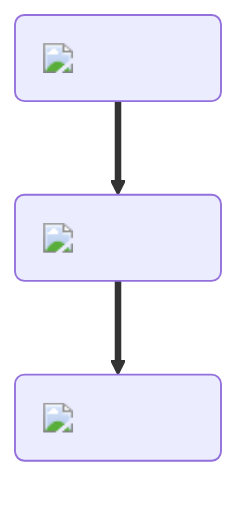

<figure markdown="1">
# French Fries
{ .item-image }

```mermaid
graph TD
    POTATO(<img src="../../assets/images/potato.webp" width="50"/>)
    POT(<img src="../../assets/images/pot.webp" width="50"/>)
    FRENCHFRIES(<img src="../../assets/images/frenchFry.webp" width="50"/>)

    POTATO ==> POT
    POT ==> FRENCHFRIES

    click POTATO "../potato"
    click POT "../pot"
    click FRENCHFRIES "../frenchFry"
```

</figure>