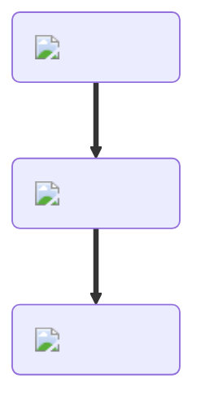

<figure markdown="1">
# Fried Chicken
{ .item-image }

```mermaid
graph TD
    CHICKEN(<img src="../../assets/images/chicken.webp" width="50"/>)
    POT(<img src="../../assets/images/pot.webp" width="50"/>)
    FRIEDCHICKEN(<img src="../../assets/images/friedChicken.webp" width="50"/>)

    CHICKEN ==> POT
    POT ==> FRIEDCHICKEN

    click CHICKEN "../chicken"
    click POT "../pot"
    click FRIEDCHICKEN "../friedChicken"
```

</figure>