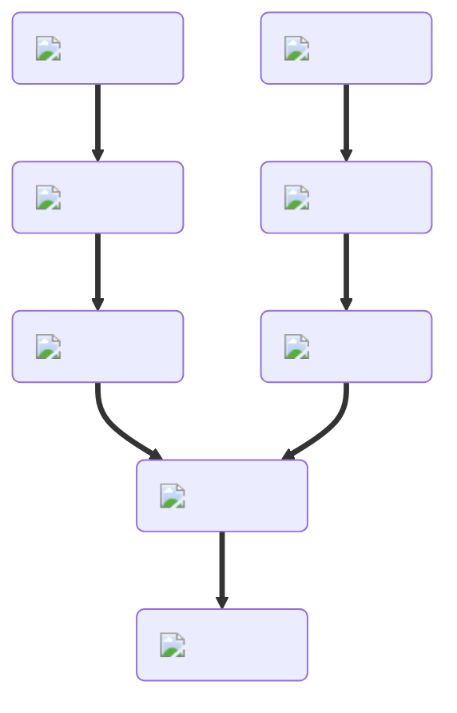

<figure markdown="1">
# Fried Chicken Sandwich
{ .item-image }

```mermaid
graph TD
    CHICKEN(<img src="/assets/images/chicken.webp" width="50"/>)
    POT1(<img src="/assets/images/pot.webp" width="50"/>)
    FRIEDCHICKEN(<img src="/assets/images/friedChicken.webp" width="50"/>)
    FLOUR(<img src="/assets/images/flour.webp" width="50"/>)
    OVEN(<img src="/assets/images/oven.webp" width="50"/>)
    BREAD(<img src="/assets/images/bread.webp" width="50"/>)
    POT2(<img src="/assets/images/pot.webp" width="50"/>)
    FRIEDCHICKENSANDWICH(<img src="/assets/images/friedChickenSandwich.webp" width="50"/>)

    CHICKEN ==> POT1
    POT1 ==> FRIEDCHICKEN
    FLOUR ==> OVEN
    OVEN ==> BREAD
    FRIEDCHICKEN ==> POT2
    BREAD ==> POT2
    POT2 ==> FRIEDCHICKENSANDWICH
    

    click CHICKEN "/chicken"
    click POT "/pot"
    click FRIEDCHICKEN "/friedChicken"
    click FLOUR "/flour"
    click OVEN "/oven"
    click BREAD "/bread"
    click POT2 "/pot"
    click FRIENDCHICKENSANDWICH "/firedChickenSandwich"
```

</figure>