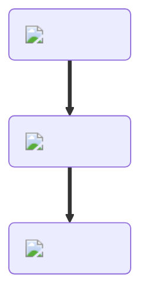

<figure markdown="1">
# Fruit Salad
{ .item-image }

```mermaid
graph TD
    FRUIT(<img src="/assets/images/fruit.webp" width="50"/>)
    POT(<img src="/assets/images/pot.webp" width="50"/>)
    FRUITSALAD(<img src="/assets/images/fruitSalad.webp" width="50"/>)

    FRUIT ==> POT
    POT ==> FRUITSALAD

    click FRUIT "/fruit"
    click POT "/pot"
    click FRUITSALAD "/fruitSalad"
```

</figure>