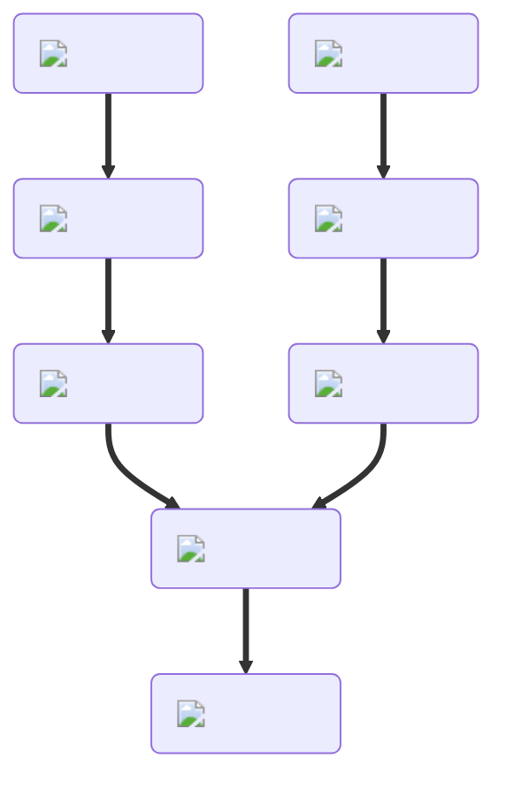

<figure markdown="1">
# Grilled Cheese Sandwich
{ .item-image }

```mermaid
graph TD
    MILK(<img src="../../assets/images/milk.webp" width="50"/>)
    POT(<img src="../../assets/images/pot.webp" width="50"/>)
    CHEESE(<img src="../../assets/images/cheese.webp" width="50"/>)
    FLOUR(<img src="../../assets/images/flour.webp" width="50"/>)
    OVEN1(<img src="../../assets/images/oven.webp" width="50"/>)
    BREAD(<img src="../../assets/images/bread.webp" width="50"/>)
    OVEN2(<img src="../../assets/images/oven.webp" width="50"/>)
    GRILLEDCHEESE(<img src="../../assets/images/grilledCheeseSandwich.webp" width="50"/>)
    
    MILK ==> POT
    POT ==> CHEESE
    FLOUR ==> OVEN1
    OVEN1 ==> BREAD
    BREAD ==> OVEN2
    CHEESE ==> OVEN2
    OVEN2 ==> GRILLEDCHEESE

    click MILK "../milk"
    click POT "../pot"
    click CHEESE "../cheese"
    click FLOUR "../flour"
    click OVEN1 "../oven"
    click BREAD "../bread"
    click OVEN2 "../oven"
    click GRILLEDCHEESE "../grilledCheseSandwich"
```

</figure>