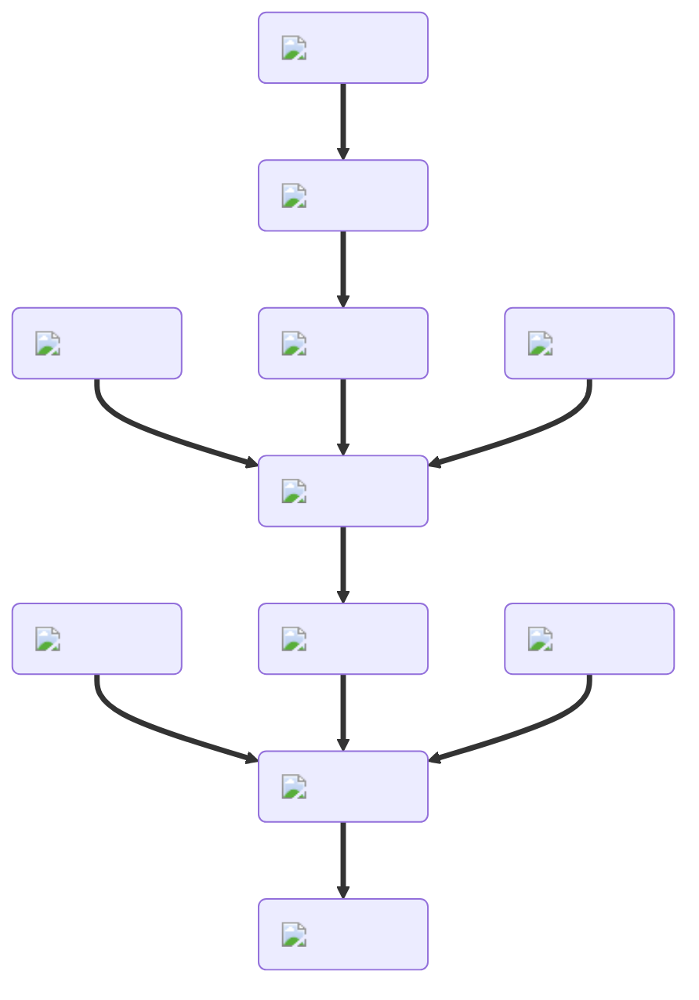

<figure markdown="1">
# Hawaiian Pizza
{ .item-image }

```mermaid
graph TD
    MILK(<img src="/assets/images/milk.webp" width="50"/>)
    POT(<img src="/assets/images/pot.webp" width="50"/>)
    CHEESE(<img src="/assets/images/cheese.webp" width="50"/>)
    FLOUR(<img src="/assets/images/flour.webp" width="50"/>)
    TOMATO(<img src="/assets/images/tomato.webp" width="50"/>)
    OVEN1(<img src="/assets/images/oven.webp" width="50"/>)
    PIZZA(<img src="/assets/images/pizza.webp" width="50"/>)
    BACON(<img src="/assets/images/bacon.webp" width="50"/>)
    FRUIT(<img src="/assets/images/fruit.webp" width="50"/>)
    OVEN2(<img src="/assets/images/oven.webp" width="50"/>)
    HAWAIIANPIZZA(<img src="/assets/images/hawaiianPizza.webp" width="50"/>)

    MILK ==> POT
    POT ==> CHEESE
    FLOUR ==> OVEN1
    CHEESE ==> OVEN1
    TOMATO ==> OVEN1
    OVEN1 ==> PIZZA
    BACON ==> OVEN2
    PIZZA ==> OVEN2
    FRUIT ==> OVEN2
    OVEN2 ==> HAWAIIANPIZZA

    click MILK "/milk"
    click POT "/pot"
    click CHEESE "/cheese"
    click FLOUR "/flour"
    click TOMATO "/tomato"
    click OVEN1 "/oven"
    click BACON "/bacon"
    click FRUIT "/fruit"
    click PIZZA "/pizza"
    click OVEN2 "/oven"
    click HAWAIIANPIZZA "/hawaiianPizza"
```

</figure>