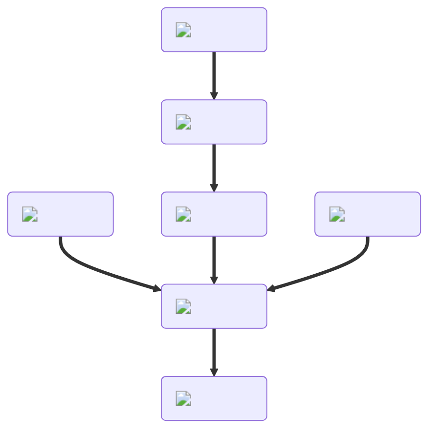

<figure markdown="1">
# Mac & Cheese
{ .item-image }

```mermaid
graph TD
    MILK1(<img src="../../assets/images/milk.webp" width="50"/>)
    POT1(<img src="../../assets/images/pot.webp" width="50"/>)
    CHEESE(<img src="../../assets/images/cheese.webp" width="50"/>)
    MILK2(<img src="../../assets/images/milk.webp" width="50"/>)
    NOODLES(<img src="../../assets/images/noodles.webp" width="50"/>)
    POT2(<img src="../../assets/images/pot.webp" width="50"/>)
    MACANDCHEESE(<img src="../../assets/images/macAndCheese.webp" width="50"/>)

    MILK1 ==> POT1
    POT1 ==> CHEESE
    MILK2 ==> POT2
    CHEESE ==> POT2
    NOODLES ==> POT2
    POT2 ==> MACANDCHEESE 

    click MILK1 "../milk"
    click POT1 "../pot"
    click CHEESE "../cheese"
    click MILK2 "../milk"
    click NOODLES "../noodles"
    click POT2 "../pot"
    click MACANDCHEESE "../macAndCheese"
```

</figure>