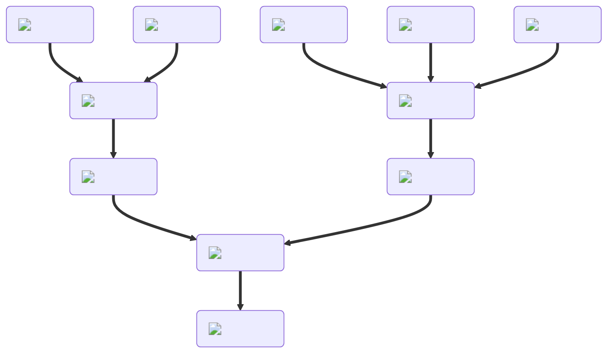

<figure markdown="1">
# Pancakes
{ .item-image }

```mermaid
graph TD
    SUGAR1(<img src="../../assets/images/sugar.webp" width="50"/>)
    SUGAR2(<img src="../../assets/images/sugar.webp" width="50"/>)
    POT1(<img src="../../assets/images/pot.webp" width="50"/>)
    SYRUP(<img src="../../assets/images/syrup.webp" width="50"/>)
    FLOUR(<img src="../../assets/images/flour.webp" width="50"/>)
    EGGS(<img src="../../assets/images/egg.webp" width="50"/>)
    MILK(<img src="../../assets/images/milk.webp" width="50"/>)
    POT2(<img src="../../assets/images/pot.webp" width="50"/>)
    BATTER(<img src="../../assets/images/batter.webp" width="50"/>)
    POT3(<img src="../../assets/images/pot.webp" width="50"/>)
    PANCAKES(<img src="../../assets/images/pancakes.webp" width="50"/>)

    SUGAR1 ==> POT1
    SUGAR2 ==> POT1
    POT1 ==> SYRUP
    FLOUR ==> POT2
    EGGS ==> POT2
    MILK ==> POT2
    POT2 ==> BATTER
    SYRUP ==> POT3
    BATTER ==> POT3
    POT3 ==> PANCAKES

    click SUGAR1 "../sugar"
    click SUGAR2 "../sugar"
    click POT1 "../pot"
    click SYRUP "../syrup"
    click FLOUR "../flour"
    click EGGS "../eggs"
    click MILK "../milk"
    click POT2 "../POT2"
    click BATTER "../batter"
    click POT3 "../pot"
    click PANCAKES "../pancakes"
```
</figure>