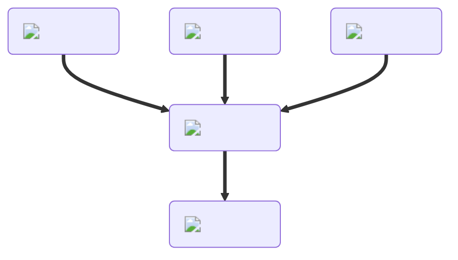

<figure markdown="1">
# Pie
{ .item-image }

```mermaid
graph TD
    FRUIT(<img src="../../assets/images/fruit.webp" width="50"/>)
    SUGAR(<img src="../../assets/images/sugar.webp" width="50"/>)
    FLOUR(<img src="../../assets/images/flour.webp" width="50"/>)
    OVEN(<img src="../../assets/images/oven.webp" width="50"/>)
    PIE(<img src="../../assets/images/pie.webp" width="50"/>)

    FRUIT ==> OVEN
    SUGAR ==> OVEN
    FLOUR ==> OVEN
    OVEN ==> PIE

    click FRUIT "../fruit"
    click SUGAR "../sugar"
    click FLOUR "../flour"
    click OVEN "../oven"
    click PIE "../pie"
```
</figure>