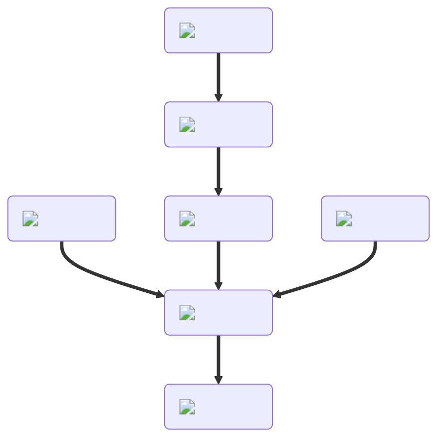

<figure markdown="1">
# Pizza
{ .item-image }

```mermaid
graph TD
    MILK(<img src="/assets/images/milk.webp" width="50"/>)
    POT(<img src="/assets/images/pot.webp" width="50"/>)
    CHEESE(<img src="/assets/images/cheese.webp" width="50"/>)
    FLOUR(<img src="/assets/images/flour.webp" width="50"/>)
    TOMATO(<img src="/assets/images/tomato.webp" width="50"/>)
    OVEN(<img src="/assets/images/oven.webp" width="50"/>)
    PIZZA(<img src="/assets/images/pizza.webp" width="50"/>)

    MILK ==> POT
    POT ==> CHEESE
    FLOUR ==> OVEN
    CHEESE ==> OVEN
    TOMATO ==> OVEN
    OVEN ==> PIZZA


    click MILK "/milk"
    click POT "/pot"
    click CHEESE "/cheese"
    click FLOUR "/flour"
    click TOMATO "/tomato"
    click OVEN "/oven"
    click PIZZA "/pizza"

```

</figure>