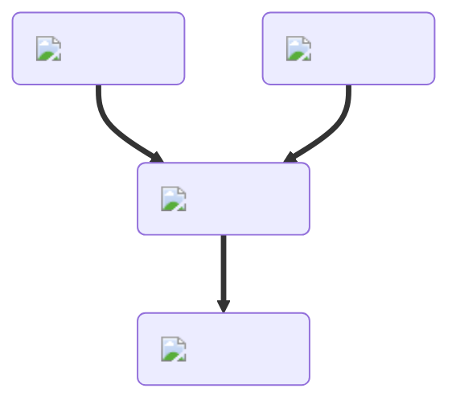

<figure markdown="1">
# Ramen
{ .item-image }

```mermaid
graph TD
    NOODLES(<img src="/assets/images/noodles.webp" width="50"/>)
    EGGS(<img src="/assets/images/egg.webp" width="50"/>)
    POT(<img src="/assets/images/pot.webp" width="50"/>)
    RAMEN(<img src="/assets/images/ramen.webp" width="50"/>)

    NOODLES ==> POT
    EGGS ==> POT
    POT ==> RAMEN

    click NOODLES "/noodles"
    click EGGS "/egg"
    click POT "/pot"
    click RAMEN "/ramen"
```

</figure>