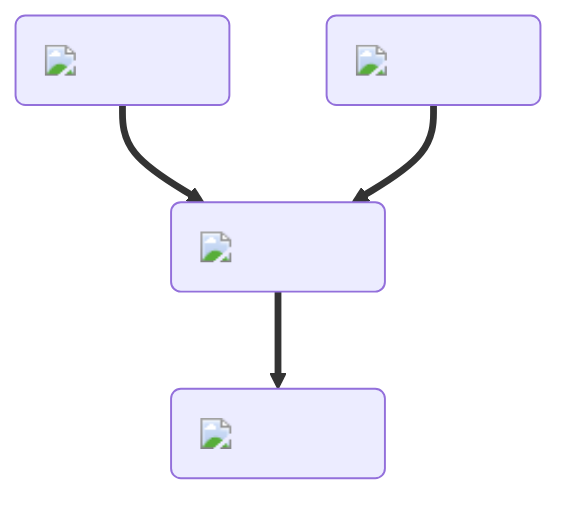

<figure markdown="1">
# Salad
{ .item-image }

```mermaid
graph TD
    TOMATO(<img src="/assets/images/tomato.webp" width="50"/>)
    LETTUCE(<img src="/assets/images/lettuce.webp" width="50"/>)
    POT(<img src="/assets/images/pot.webp" width="50"/>)
    SALAD(<img src="/assets/images/salad.webp" width="50"/>)

    TOMATO ==> POT
    LETTUCE ==> POT
    POT ==> SALAD 
    
    click TOMATO "/tomato"
    click LETTUCE "/lettuce"
    click POT "/pot"
    click SALAD "/salad"
```

</figure>