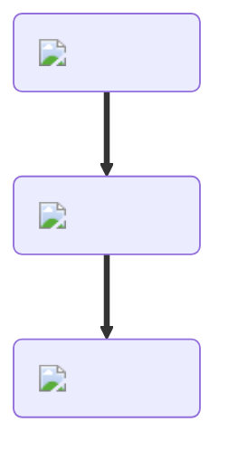

<figure markdown="1">
# Sausage
{ .item-image }

```mermaid
graph TD
    BACON(<img src="/assets/images/bacon.webp" width="50"/>)
    OVEN(<img src="/assets/images/oven.webp" width="50"/>)
    SAUSAGE(<img src="/assets/images/sausage.webp" width="50"/>)

    BACON ==> OVEN
    OVEN ==> SAUSAGE

    click BACON "/bacon"
    click OVEN "/oven"
    click SAUSAGE "/sausage"
```

</figure>