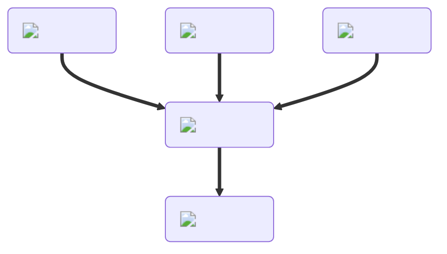

<figure markdown="1">
# Spaghetti & Meatballs
{ .item-image }

```mermaid
graph TD
    NOODLES(<img src="../../assets/images/noodles.webp" width="50"/>)
    BEEF(<img src="../../assets/images/beef.webp" width="50"/>)
    TOMATO(<img src="../../assets/images/tomato.webp" width="50"/>)
    POT(<img src="../../assets/images/pot.webp" width="50"/>)
    SPAGHETTI(<img src="../../assets/images/spaghettiAndMeatballs.webp" width="50"/>)

    NOODLES ==> POT
    BEEF ==> POT
    TOMATO ==> POT
    POT ==> SPAGHETTI

    click NOODLES "../noodles"
    click BEEF "../beed"
    click POT "../pot"
    click SPAGHETTI "../spaghettiAndMeatballs"
```

</figure>