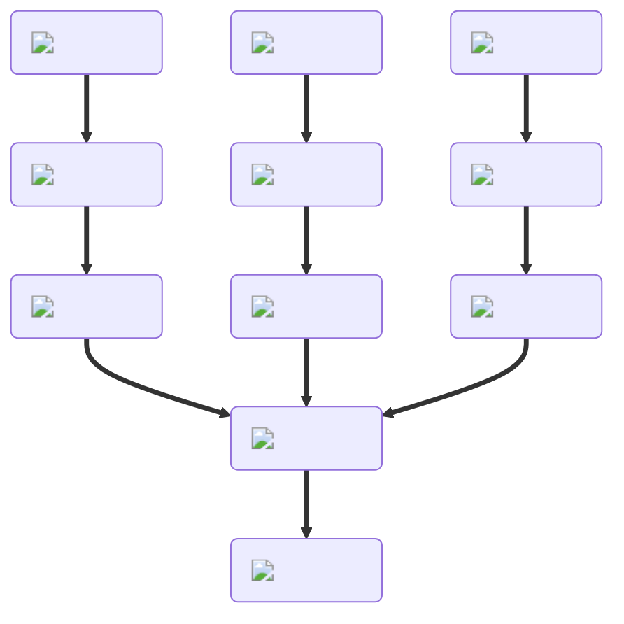

<figure markdown="1">
# Steak Sandwich
{ .item-image }

```mermaid
graph TD
    FLOUR(<img src="/assets/images/flour.webp" width="50"/>)
    OVEN(<img src="/assets/images/oven.webp" width="50"/>)
    BREAD(<img src="/assets/images/bread.webp" width="50"/>)
    BEEF(<img src="/assets/images/beef.webp" width="50"/>)
    POT1(<img src="/assets/images/pot.webp" width="50"/>)
    STEAK(<img src="/assets/images/steak.webp" width="50"/>)
    MILK(<img src="/assets/images/milk.webp" width="50"/>)
    POT2(<img src="/assets/images/pot.webp" width="50"/>)
    CHEESE(<img src="/assets/images/cheese.webp" width="50"/>)
    POT3(<img src="/assets/images/pot.webp" width="50"/>)
    STEAKSUB(<img src="/assets/images/steakSub.webp" width="50"/>)

    FLOUR ==> OVEN
    OVEN ==> BREAD
    BEEF ==> POT1
    POT1 ==> STEAK
    MILK ==> POT2
    POT2 ==> CHEESE
    BREAD ==> POT3
    STEAK ==> POT3
    CHEESE ==> POT3
    POT3 ==> STEAKSUB

    click FLOUR "/flour"
    click OVEN "/oven"
    click BREAD "/bread"
    click MILK "/milk"
    click POT1 "/pot"
    click CHEESE "/cheese"
    click BEEF "/beef"
    click POT2 "/pot"
    click STEAK "/steak"
    click POT3 "/pot"
    click STEAKSUB "/steakSub"
```

</figure>