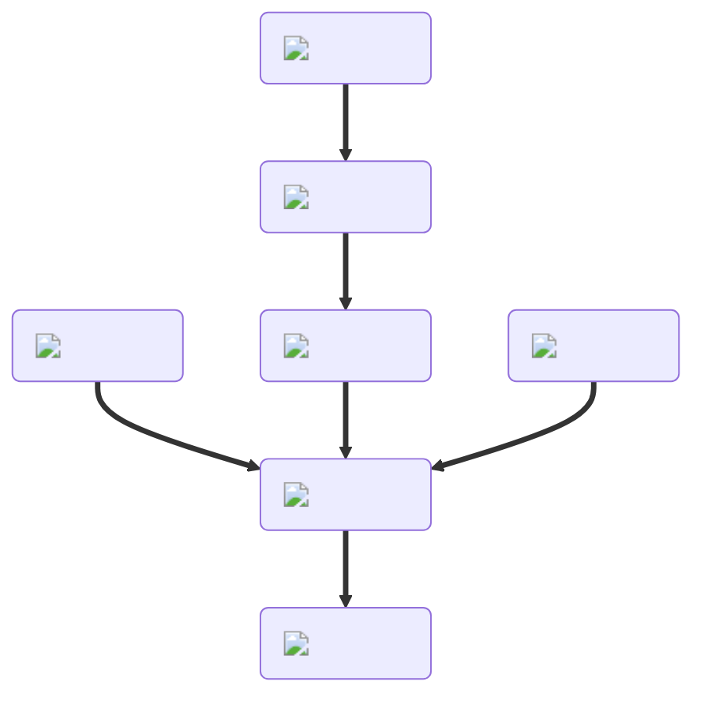

<figure markdown="1">
# Stir Fry
{ .item-image }

```mermaid
graph TD
    BEEF(<img src="../../assets/images/beef.webp" width="50"/>)
    POT1(<img src="../../assets/images/pot.webp" width="50"/>)
    STEAK(<img src="../../assets/images/steak.webp" width="50"/>)
    LETTUCE(<img src="../../assets/images/lettuce.webp" width="50"/>)
    NOODLES(<img src="../../assets/images/noodles.webp" width="50"/>)
    POT2(<img src="../../assets/images/pot.webp" width="50"/>)
    STIRFRY(<img src="../../assets/images/stirFry.webp" width="50"/>)

    BEEF ==> POT1
    POT1 ==> STEAK
    LETTUCE ==> POT2
    STEAK ==> POT2
    NOODLES ==> POT2
    POT2 ==> STIRFRY 

    click BEEF "../beef"
    click POT1 "../pot"
    click STEAK "../steak"
    click LETTUCE "../lettuce"
    click NOODLES "../noodles"
    click POT2 "../pot"
    click STIRFRY "../stirFry"
```
</figure>