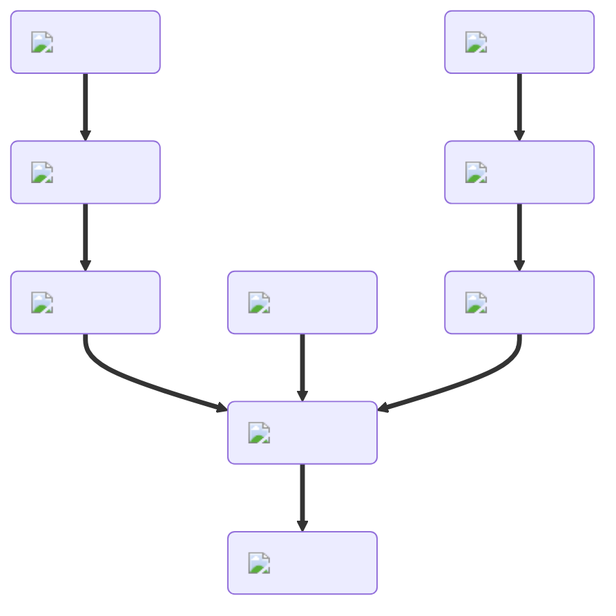

<figure markdown="1">
# Chicken Taco
{ .item-image }

```mermaid
graph TD
    FLOUR(<img src="/assets/images/flour.webp" width="50"/>)
    POT1(<img src="/assets/images/pot.webp" width="50"/>)
    TORTILLA(<img src="/assets/images/tortilla.webp" width="50"/>)
    MILK(<img src="/assets/images/milk.webp" width="50"/>)
    POT2(<img src="/assets/images/pot.webp" width="50"/>)
    CHEESE(<img src="/assets/images/cheese.webp" width="50"/>)
    CHICKEN(<img src="/assets/images/chicken.webp" width="50"/>)
    POT3(<img src="/assets/images/pot.webp" width="50"/>)
    CHICKENTACO(<img src="/assets/images/tacoChicken.webp" width="50"/>)

    FLOUR ==> POT1
    POT1 ==> TORTILLA
    MILK ==> POT2
    POT2 ==> CHEESE
    TORTILLA ==> POT3
    CHICKEN ==> POT3
    CHEESE ==> POT3
    POT3 ==> CHICKENTACO

    click FLOUR "/flour"
    click POT1 "/pot"
    click TORTILLA "/tortilla"
    click MILK "/milk"
    click POT2 "/pot"
    click CHEESE "/cheese"
    click CHICKEN "/chicken"
    click POT3 "/pot"
    click CHICKENTACO "/tacoChicken"
```

</figure>