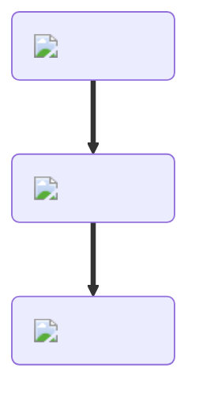

<figure markdown="1">
# TomatoSoup
{ .item-image }

```mermaid
graph TD
    TOMATO(<img src="/assets/images/tomato.webp" width="50"/>)
    POT(<img src="/assets/images/pot.webp" width="50"/>)
    TOMATOSOUP(<img src="/assets/images/tomatoSoup.webp" width="50"/>)
    
    TOMATO ==> POT
    POT ==> TOMATOSOUP

    click TOMATO "/tomato"
    click POT "/pot"
    click TOMATOSOUP "/tomatoSoup"
```

</figure>