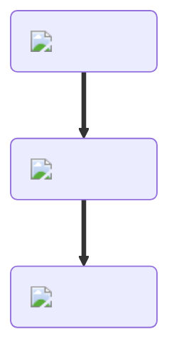

<figure markdown="1">
# Tortilla
{ .item-image }

```mermaid
graph TD
    FLOUR(<img src="/assets/images/flour.webp" width="50"/>)
    POT(<img src="/assets/images/pot.webp" width="50"/>)
    TORTILLA(<img src="/assets/images/tortilla.webp" width="50"/>)

    FLOUR ==> POT
    POT ==> TORTILLA

    click FLOUR "/flour"
    click POT "/pot"
    click TORTILLA "/tortilla"
```

</figure>