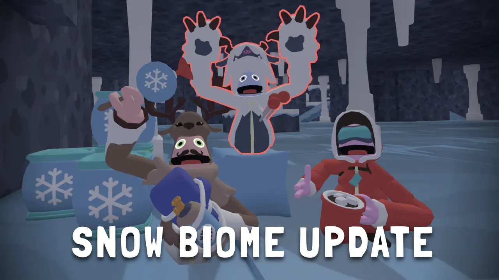
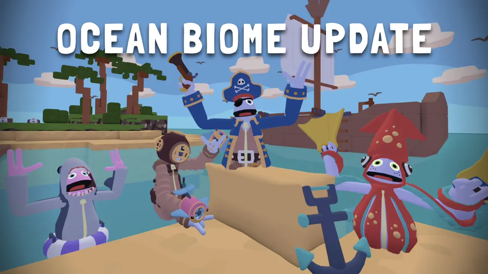
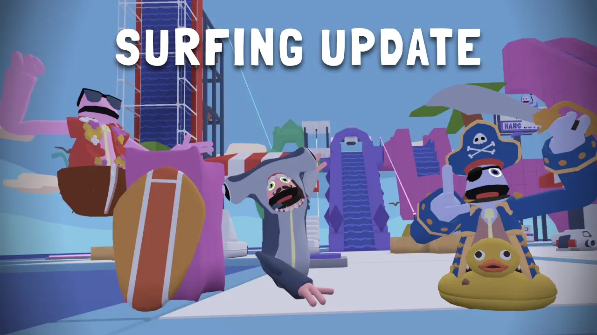
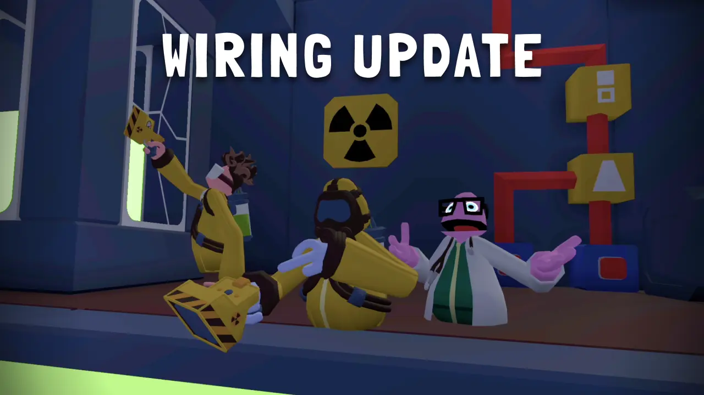
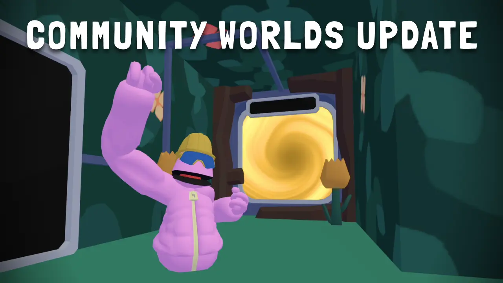
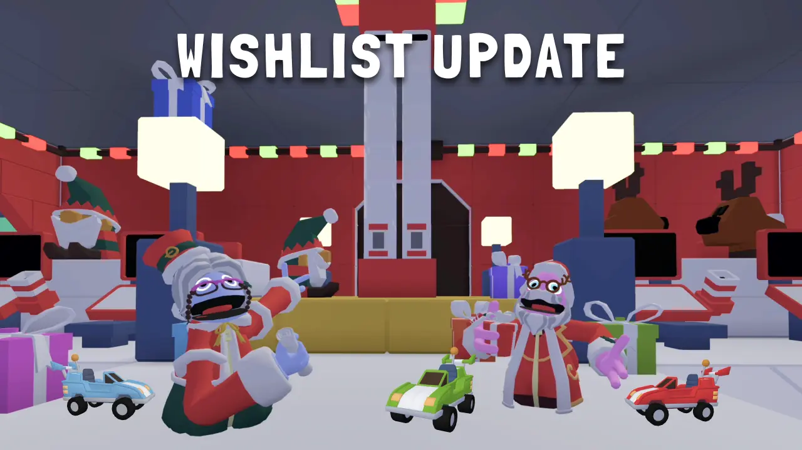
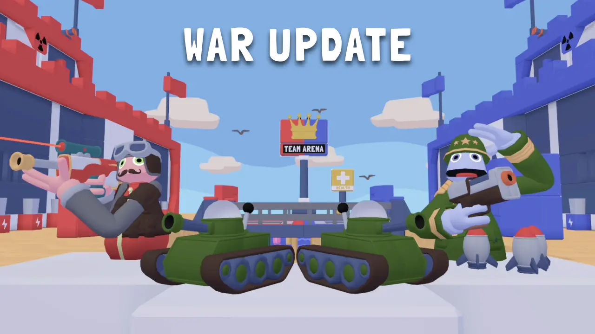
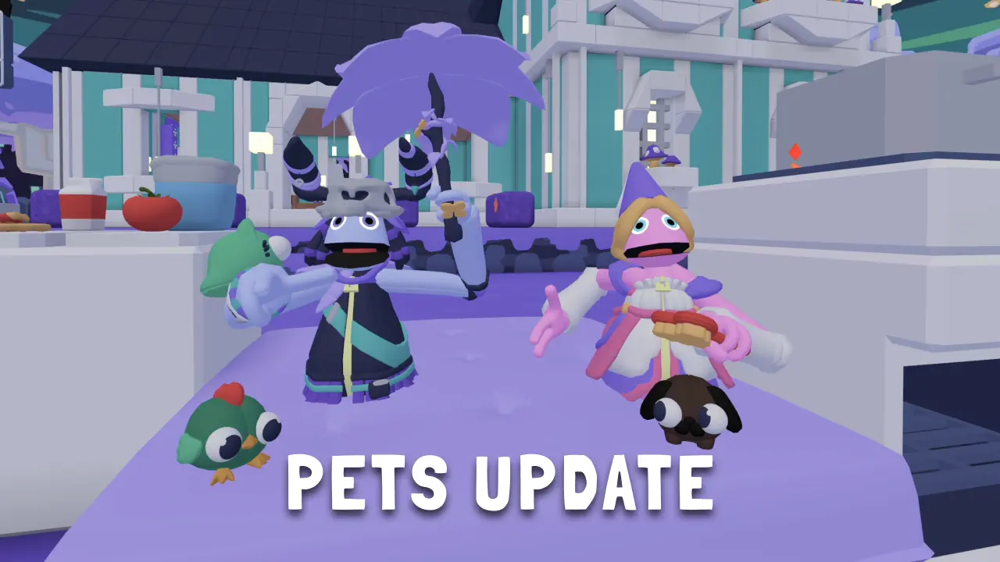

<figure markdown="1">
# All Updates and Release Notes

- [Alpha  { loading=lazy .round-image }](../releaseNotes/alpha.md)
- [Beta  { loading=lazy .round-image }](../releaseNotes/beta.md)
- [Rockstar Update  { loading=lazy .round-image }](../releaseNotes/rockstar.md)
- [Snow Biome Update  { loading=lazy .round-image }](../releaseNotes/snowBiome.md)
- [Grappling Update  { loading=lazy .round-image }](../releaseNotes/grappling.md)
- [Graduation Update  { loading=lazy .round-image }](../releaseNotes/graduation.md)
- [Party Update  { loading=lazy .round-image }](../releaseNotes/party.md)
- [Ocean Update  { loading=lazy .round-image }](../releaseNotes/ocean.md)
- [Surfing Update  { loading=lazy .round-image }](../releaseNotes/surfing.md)
- [Wiring Update  { loading=lazy .round-image }](../releaseNotes/wiring.md)
- [Community Worlds Update  { loading=lazy .round-image }](../releaseNotes/communityWorlds.md)
- [Halloween Update  { loading=lazy .round-image }](../releaseNotes/halloween.md)
- [Arena Update  { loading=lazy .round-image }](../releaseNotes/arena.md)
- [Plush Mini Update  { loading=lazy .round-image }](../releaseNotes/plush.md)
- [Wishlist Update  { loading=lazy .round-image }](../releaseNotes/wishlist.md)
- [War Update  { loading=lazy .round-image }](../releaseNotes/war.md)
- [World Editing Mini Update  { loading=lazy .round-image }](../releaseNotes/worldEditing.md)
- [Battlecraft Update  { loading=lazy .round-image }](../releaseNotes/battlecraft.md)
- [Valentines Update  { loading=lazy .round-image }](../releaseNotes/valentines.md)
- [Fantasy Update  { loading=lazy .round-image }](../releaseNotes/fantasy.md)
- [Pets Update  { loading=lazy .round-image }](../releaseNotes/pets.md)
- [Tuesday Update  { loading=lazy .round-image }](../releaseNotes/tuesday.md)
- [Barnyard Bonus Update  { loading=lazy .round-image }](../releaseNotes/barnyard.md)

</figure>